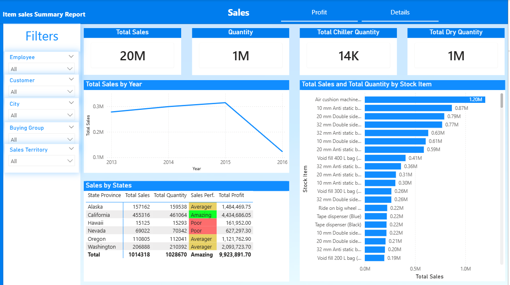
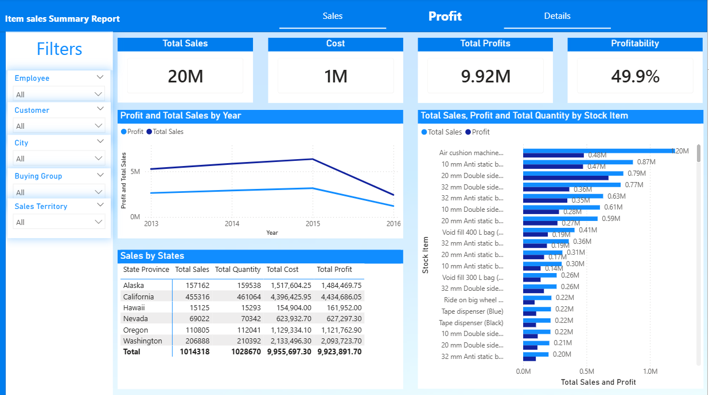
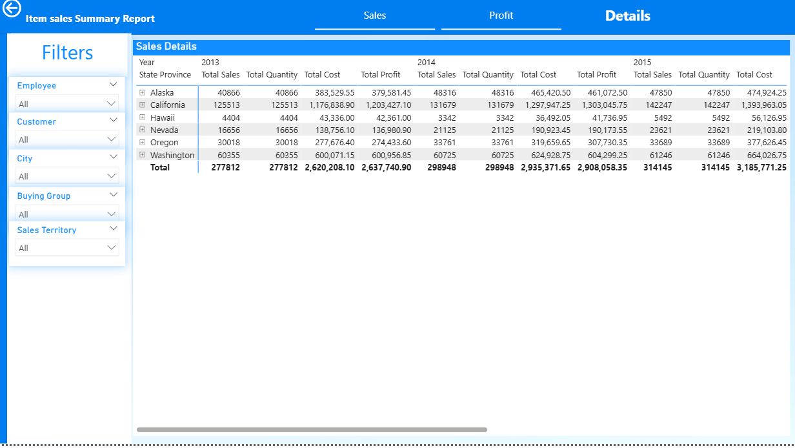

# 📊 Power BI Dynamic Sales Dashboard

## 📌 Project Overview
This project is a comprehensive **Power BI** dashboard designed to provide actionable business insights. It transforms complex datasets into an interactive visual experience, allowing stakeholders to track Key Performance Indicators (KPIs) and analyze sales dynamics across different dimensions.

## 📸 Dashboard Preview

  

  

  

## 🛠️ Key Features & Skills Applied
- **Data Modeling:** Established relationships between multiple tables (Fact and Dimension tables) using a Star Schema.
- **DAX Calculations:** Created custom **DAX measures** (Calculated Columns & Measures) for advanced metrics like Year-to-Date (YTD) sales, Year-over-Year (YoY) growth, and Profit Margins.
- **Interactive Visualizations:** Integrated Slicers, Drill-through filters, and Tooltips for a deeper exploration of the data.
- **Data Transformation (Power Query):** Cleaned and reshaped raw data using Power Query to ensure data accuracy and integrity.

## 🧰 Tools Used
- **Power BI Desktop**
- **Power Query** (ETL Process)
- **DAX** (Data Analysis Expressions)

## 📊 Key Insights
- Visualized sales distribution by region and product category.
- Identified top-performing products and sales representatives.
- Analyzed monthly and quarterly trends to forecast business growth.
